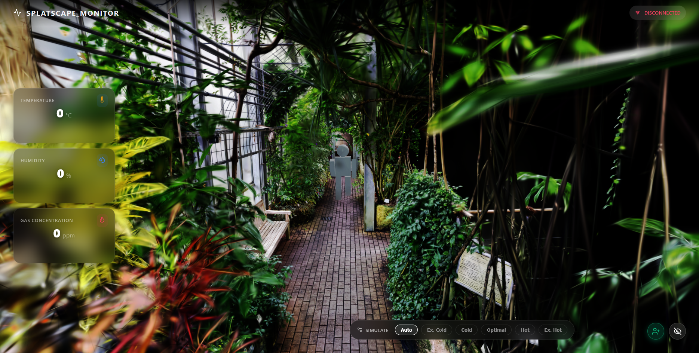

# 🌍 Splatscape: Real-Time Spatial IoT Monitor

Splatscape is a full-stack, spatial computing IoT application built during the Code the Future Hackathon 2026 powered by Siemens. It bridges the gap between raw physical hardware and interactive 3D web environments rendered through the use of Gaussian Splats. 

Using an ESP32-C6 microcontroller, custom C drivers, and a React + Three.js frontend, Splatscape reads real-world physical data (proximity, temperature, humidity, and gas concentration) and translates it into a living, procedural 3D world in real-time.



## ✨ Key Features

* **Standalone ESP32 Web Server:** The microcontroller doesn't just broadcast data; it acts as a fully independent web server using FreeRTOS, handling custom CORS headers and HTTP polling requests directly from the browser.
* **Procedural 3D Humanoids:** Real-world movement triggers virtual movement. When a person walks past the physical ultrasonic sensor, a procedural 3D humanoid spawns and navigates the 3D Gaussian Splat environment using trigonometry.
* **Environmental Reactivity:**
  * **Color Mapping:** The humanoid's glowing aura dynamically changes based on the physical room temperature (Blue for cold, Green for optimal, Red for hot).
  * **Panic Mode:** If the MQ-3 sensor detects a sudden spike in gas/alcohol vapor, the virtual humanoids break into a sprint (2.5x speed multiplier).
* **Glassmorphism UI:** A sleek, Framer Motion-powered dashboard tracks the last 20 data points with smooth Recharts sparklines.
* **Photorealistic 3D Gaussian Splatting:** Instead of using heavy, traditional polygon meshes, the virtual environment is a photorealistic 3D scan rendered using Gaussian Splats. By leveraging `@react-three/drei`, the browser calculates millions of localized volumetric data points (splats) to render the real-world garden at a flawless 60 FPS.

## 🏗️ Architecture & Tech Stack

Splatscape operates on a decentralized **Plan B** architecture (Direct ESP32-to-React), eliminating the need for a Python middleman server.

**Hardware (C / ESP-IDF / PlatformIO)**
* **ESP32-C6:** The brain. Runs a multi-threaded FreeRTOS environment.
* **HC-SR04 (Ultrasonic):** Monitored via a custom median-filter driver to eliminate acoustic noise and ghost echoes.
* **MQ-3 (Gas):** Analog voltage read via ADC, smoothed over 10 rapid samples.
* **DHT22 (Temp/Humidity):** Custom bit-banging driver to read microsecond timings.

**Software (JavaScript / React / Three.js)**
* **React + Vite:** Handles state, cooldown timers, and HTTP polling (every 500ms).
* **React-Three-Fiber & Drei:** Powers the 3D canvas. The `<Splat>` component from Drei is used to parse and render the `.splat` file, blending WebGL performance with raw spatial photography.
* **Framer Motion & Recharts:** Animates the floating metric cards and live graphs.

---

## 🚀 Getting Started

### 1. Hardware Setup (ESP32)
1. Open the `esp32-node` folder in **VS Code with PlatformIO**.
2. Open `src/main.c` and update the Wi-Fi credentials to match your network:
   ```c
   #define WIFI_SSID      "Your_Network_Name"
   #define WIFI_PASS      "Your_Password"
   ```
3. **Wiring:** Ensure the MQ-3 and HC-SR04 sensors are powered via the **5V / VIN** pin on the ESP32 (3.3V will starve the gas heater and cause Wi-Fi noise loops).
4. Build and Upload to the ESP32. 
5. Open the Serial Monitor (`115200` baud). Wait 5 seconds, press the EN/RST button on the board, and copy the IP address it prints out.

### 2. Software Setup (React)
1. Open the `react-app` folder in your terminal.
2. Install the dependencies:

       npm install

3. Open `src/App.jsx` and paste the ESP32's IP address into the fetch URL:

       const ESP32_URL = 'http://YOUR_ESP32_IP/data'; 

4. Start the development server:

       npm run dev

## 🧠 Hardware Quirks & Notes
* **Sensor Burn-in:** The MQ-3 gas sensor requires a literal heating coil to function. Brand new sensors need about 24-48 hours of constant 5V power to "burn off" factory anti-corrosion chemicals before the baseline stabilizes.
* **Acoustic Overlap:** The HC-SR04 ultrasonic sensor requires a strict 60ms delay between pings. Pinging faster than the speed of sound causes the sensor to catch its own echoes, resulting in "Clone Armies" spawning in the React app. We fixed this using a hardware delay and a 2000ms React cooldown.

## 📸 3D Assets & Scanning
The 3D environment (`garden.splat`) was captured and generated using a 3D scanning application. Gaussian Splatting allowed us to take a real-world physical space and port it directly into the React canvas with zero traditional 3D modeling required.

---
*Built with inhuman amounts of caffeine and zero sleep :)*
